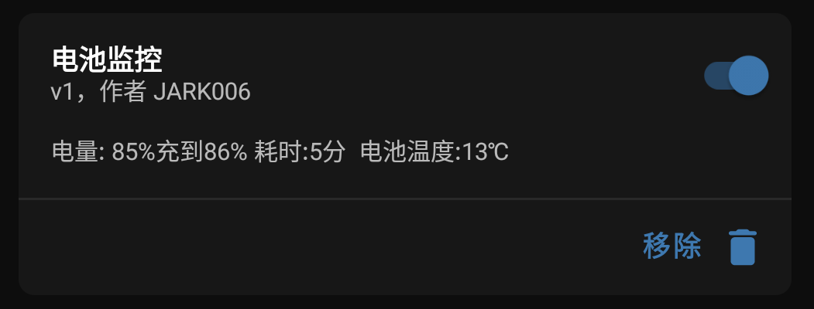
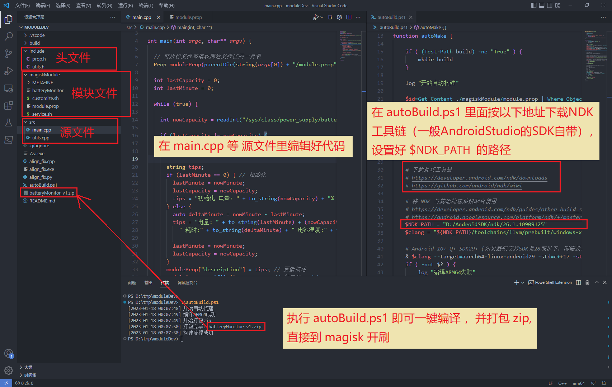

# C/C++开发Magisk模块工程

### 这是一个简易的电池电量日志模块，记录电量变化，温度等等

## 上手步骤(适合Windows下开发):

1. 下载 [vscode](https://code.visualstudio.com/) 或者使用其他你熟悉的编辑器或IDE，打开本文件夹。

1. 如果你已安装`Android Studio`，其SDK目录下一般含有NDK工具链，否则需要单独下载 [NDK工具链](https://developer.android.com/ndk/downloads) 并解压，路径最好不要包含中文。

1. 在 `build.ps1` 和 `buildOnly.ps1` 脚本中给 `$windowsToolchainsDir` 设置 NDK工具链路径。

1. 在 `.vscode/c_cpp_properties.json` 文件的 `includePath` 里设置 `NDK头文件` 路径，助于 vsCode IntelliSense 智能提示。

1. 在 `magiskModule/module.prop` 中自定义模块信息, 编译脚本会把 `id` 的值会作为编译输出文件名。

1. 在 `magiskModule/service.sh` 中把启动路径 `$MODDIR/batteryMonitor` 改为你的可执行文件路径，即上一步设置编译输出的文件名。

1. 执行 `build.ps1` 一键编译并自动打包zip, 可以直接到Magisk刷入。

1. 执行 `buildOnly.ps1` 则只编译，编译的可执行文件将输出到 `build/`。

1. `build.ps1` 已设置为默认`启动调试`脚本，在 vsCode 下按 `F5` 即可一键执行。

